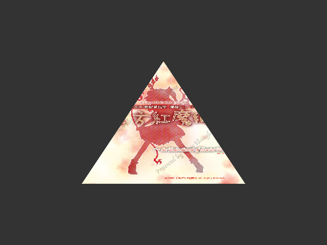
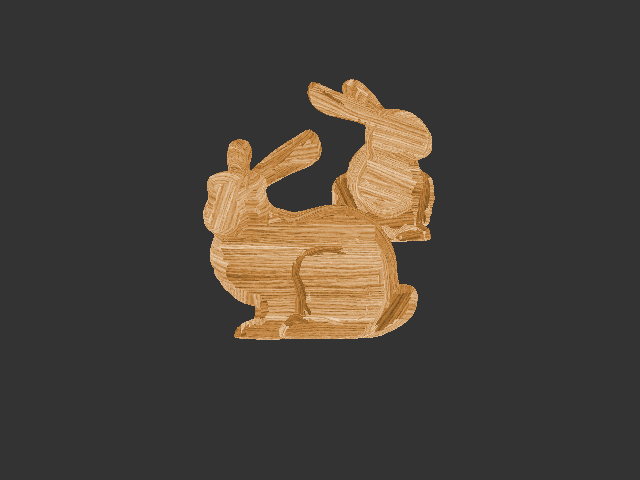
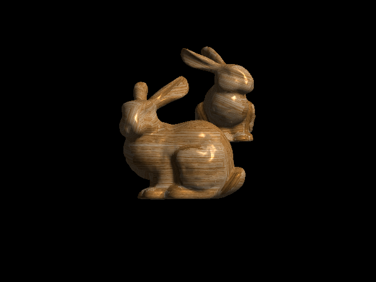

Graphics Practice
=================

Computer graphics practice, written in OpenGL and Common Lisp

Requirement:

* SBCL
* SDL2
* cl-png
  - libpng12
* Linux

Load files: `sbcl --load triangle.lisp`

* `triangle.lisp`
  - Basic draw array
  - 
* `quad.lisp`
  - Draw with EBO
  - 
* `color.lisp`
  - The color of the quad changing over time.
  - Passing color value to Shader program using uniform
  - 2 different Shader programs
  - 
* `texture.lisp`
  - load texture
  - 
* `perspective.lisp`
  - load obj model
  - projection
  - 
* `light.lisp`
  - ambient, diffuse, specular
  - 
