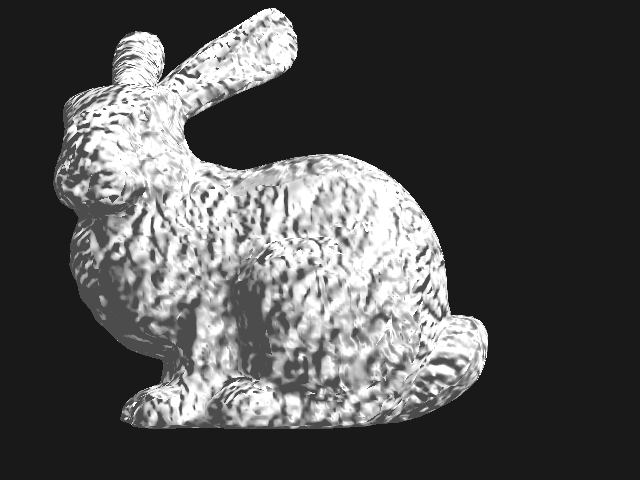

Graphics Practice
=================

Computer graphics practice, written in OpenGL and Common Lisp

Rewriting!

This is the second time I write this repo, this time I want to figure out how to make a non-trivial game in Common Lisp, so this time I will need to establish a whole set of libraries and practices of doing this in Common Lisp.

License
-------

The code in this repo is in the public domain, use at your own risk.

The resources in `./img` might have some copyright issues.

Requirement
-----------

Libraries:

* SBCL
* SDL2
  - Provide window functionalities
  - Debian 11: `libsdl2-2.0-0`
* stb
  - Load texture
  - Debian 11: `libstb0`
* assimp
  - Load 3D mesh
  - Debian 11: `libassimp5 libassimp-dev`
* Made on Linux

Lisp libraries:

* cl-sdl2
  - Provide Window and user input events
  - Note that I find the cl-sdl2 is very hard to use, as it's very different from the document of SDL2, while it dosen't give much documentations. Also the functionality is not close to complete.
  - However, the `sdl2-ffi` and `sdl2-ffi.functions` packages are very easy to use, they are generated from the c2ffi file, thus can be used as the same way of SDL2 in C.
* cl-opengl
  - Just noticed recently this is actually very nice
  - OpenGL provides a [XML](https://github.com/KhronosGroup/OpenGL-Registry/blob/main/xml/gl.xml) to declare all of their interfaces, thus user of all languages can generate their own bindings. This cl-opengl is generated from the XML.
  - Random thinking: Probably people should invest more on making things generally available like this, for example, an ABI interface language which can be bind to all programming languages. Such interfacing language should be easy to parse (of course without using clang / LLVM stack) with simple script (within 1000 line of code).
* 3d-matrices, 3d-vectors
  - Handy to represent and calculate graphics math.
* uiop
  - Everything need this

Available so far
----------------

Load files: `sbcl --load triangle.lisp`

* `triangle.lisp`
  - Basic draw array
  - 
* ~~`quad.lisp`~~
  - Draw with EBO
  - 
* ~~`color.lisp`~~
  - The color of the quad changing over time.
  - Passing color value to Shader program using uniform
  - 2 different Shader programs
  - 
* ~~`texture.lisp`~~
  - load texture
  - 
* ~~`perspective.lisp`~~
  - load obj model
  - projection
  - 
* ~~`light.lisp`~~
  - ambient, diffuse, specular
  - 
* ~~`normalmap.lisp`~~
  - normal map
  - 
* ~~`gold.lisp`~~
  - material
  - cube map
  - 

Acknowledgement
---------------

* [stone normal map](https://opengameart.org/content/ground-outdoors-dirt-and-stones-seamless-texture-with-normalmap-dirtandstonesnjpg)
  - by Keith333(under CC-BY 3.0)
* [wood](https://www.publicdomainpictures.net/en/view-image.php?image=209094&picture=natural-wood-grain-background)
  - by Alex Borland(in public domain)
* box.obj
  - box.blend
  - made by [Blender](https://www.blender.org/)
* skybox
  - work of Emil Persson(Creative Commons Attribution 3.0 Unported License)
